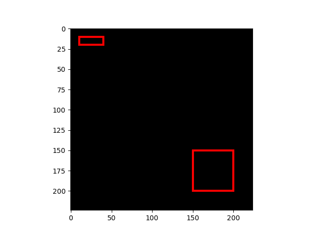
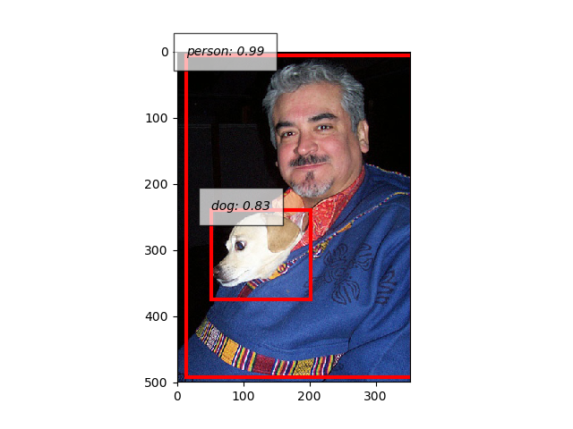

Object Detection Tutorial
=========================

This tutorial will walk you through the implementations and tools for Object Detection provided by ChainerCV.

In ChainerCV, we define the object detection task as a problem of predicting bounding boxes around regions where objects are located from an image and recognizing the category of the objects.
ChainerCV supports this task by providing following features:

+ Visualization
+ BboxDataset
+ Detection Link
+ DetectionEvaluator
+ Training script for various detection models

Bounding boxes in ChainerCV
---------------------------
In ChainerCV, bounding boxes in an image are represented as a two-dimensional array of shape :math:`(R, 4)`,
where :math:`R` is the number of bounding boxes.
The second axis corresponds to the coordinates of bounding boxes.
They are ordered as :obj:`(y_min, x_min, y_max, x_max)`, where
:obj:`(y_min, x_min)` and :obj:`(y_max, x_max)` are the left bottom and the right bottom coordinates.
Notice that ChainerCV orders coordinates by :obj:`yx` order, which is the opposite from the order used by some other libraries such as OpenCV.
This convention is adopted because the order is more consistent with the memory order of an image that follows row-column order.
In the case of bounding boxes for multiple images, list of bounding boxes are used.

Let's give an example with a simple toy data.

.. code-block:: python

    import numpy as np
    from chainercv.visualizations import vis_bbox
    import matplotlib.pyplot as plt
    img = np.zeros((3, 224, 224), dtype=np.float32)
    bbox = np.array([[10, 10, 20, 40], [150, 150, 200, 200]])

    chainercv.visualizations.vis_bbox(img, bbox)
    plt.show()

In this example, two bounding boxes are displayed on top of a black image.
:func:`chainercv.visualizations.vis_bbox` is a utility function that can visualize
bounding boxes and an image together.

Bounding Box Dataset
--------------------
ChainerCV supports datasets that contain bounding box annotations.
Dataset classes whose names end with :obj:`BboxDataset` have bounding boxes as its main annotation.
These datasets return a tuple of an image, bounding boxes and labels when indexed.
The labels is an :obj:`np.int32` array of shape :math:`(R,)`. Each element corresponds to a label of an object in the corresponding bounding box.

A mapping between an integer label and a name in alphabet differs between datasets.
This mapping can be obtained from objects whose names end with :obj:`label_names`.
These mapping becomes helpful when bounding boxes need to be visualized with label names.
In the next example, the interface of :obj:`BboxDataset` and the functionality of :obj:`vis_bbox` to visualize label names are illustrated.

.. code-block:: python

    from chainercv.visualizations import vis_bbox
    from chainercv.datasets import VOCBboxDataset
    from chainercv.datasets import voc_bbox_label_names
    import matplotlib.pyplot as plt
    dataset = VOCBboxDataset(year='2012')
    img, bbox, label = dataset[0]
    print(bbox.shape)  # (2, 4)
    print(label.shape)  # (2,)
    vis_bbox(img, bbox, label, label_names=voc_bbox_label_names)
    plt.show()

.. figure:: ../../image/detection_tutorial_bbox_dataset_vis.png 
    :scale: 60%
    :align: center

Note that the example downloads VOC 2012 dataset at runtime in the first run.

Detection Link
--------------
ChainerCV provides several implementations that predicts solutions of the object detection problem.
For example, we support Single Shot MultiBox Detector (SSD) and Faster R-CNN.
Despite the difference between the models in how prediction is carried out internally,
they support the common interface for prediction using the method :meth:`predict`.
This method takes a list of images and returns prediction results.
The results are tuple of lists, :obj:`bboxes, labels, scores`.
The more description can be found here (:meth:`chainercv.links.SSD.predict`).

The inference with these models can be carried out instantly thanks to pretrained weights that can be downloaded.
The models take option :obj:`pretrained_model` and download weights if the argument is included in the set of the names of prepared weights.

.. code-block:: python

    from chainercv.visualizations import vis_bbox
    from chainercv.datasets import VOCBboxDataset
    from chainercv.datasets import voc_bbox_label_names
    from chainercv.links import SSD300
    import matplotlib.pyplot as plt
    dataset = VOCBboxDataset(year='2007', split='test')
    img, _, _ = dataset[0]
    model = SSD300(pretrained_model='voc0712')
    bboxes, labels, scores = model.predict([img])
    vis_bbox(img, bboxes[0], labels[0], scores[0],
             label_names=voc_bbox_label_names)
    plt.show()

The above example puts together features of detection link.
It prepares SSD300 model with weights trained on VOC 2007 and VOC 2012 datasets.
The model runs prediction using :meth:`predict`, and the ouptus are visualized using
:func:`chainercv.visualizations.vis_bbox`.
Note that in this case, confidence scores are visualized as well.

Detection Evaluator
-------------------
ChainerCV provides functionalities that makes evaluating detection links easier.
They are provided at two level: evaluator extensions and evaluation functions.

The evaluation on detection task can be done using evaluator extensions such as
:class:`chainercv.extensions.DetectionVOCEvaluator`.
These extension inherit from :class:`chainer.training.extensions.Evaluator`,
and have similar interface.
They are initialized by taking an iterator and a network that carries out prediction.
When this class is called, many things happen.
First, it iterates over a dataset based on an iterator.
Second, the network makes prediction using the images collected from the dataset.
Last, an evaluation function is called with the ground truth and the prediction results.
Importantlly, detection evaluators only accept networks that support detection link interface
because prediction is carried out inside the evaluator based on the interface.

In contrast to detection evaluators that take coarse approach,
evaluation functions such as :meth:`chainercv.evaluations.eval_detection_voc`
are provided for those who need finer level of control.
These functions take the ground truth and prediction results as arguments
and return measured performance.

Here is a minimum example that uses a detection evaluator.

.. code-block:: python

   from chainer.iterators import SerialIterator
   from chainer.datasets import SubDataset
   from chainercv.datasets import VOCBboxDataset
   from chainercv.links import SSD300
   from chainercv.extensions import DetectionVOCEvaluator
   from chainercv.datasets import voc_bbox_label_names

   # Only use subset of dataset so that evaluation finishes quickly.
   dataset = VOCBboxDataset(year='2007', split='test')
   dataset = dataset[:5]
   it = SerialIterator(dataset, 1, repeat=False, shuffle=False)
   model = SSD300(pretrained_model='voc0712')
   evaluator = DetectionVOCEvaluator(it, model,
                                     label_names=voc_bbox_label_names)
   # result is a dictionary of evaluation scores. Print it and check it.
   result = evaluator()

Training Detection Links
------------------------
By putting together all the functions and utilities, training scripts can be easily written.
Please check training scripts contained in examples.
Also, ChainerCV posts the performance achieved through running the training script in README.

+ `Faster R-CNN examples <https://github.com/chainer/chainercv/tree/master/examples/faster_rcnn>`_
+ `SSD examples <https://github.com/chainer/chainercv/tree/master/examples/ssd>`_
