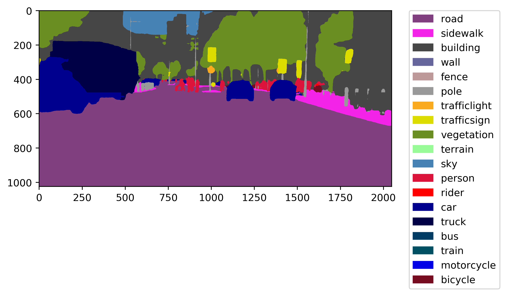

Pyramid Scene Parsing Network
=============================

This is an unofficial implementation of Pyramid Scene Parsing Network (PSPNet) in Chainer.

# Inference using converted weights

## Requirement

- Python 3.4.4+
    - Chainer 3.0.0b1+
    - ChainerCV 0.6.0+
    - Matplotlib 2.0.0+
    - CuPy 2.0.0b1+

## Run demo.py

```
$ python demo.py -g 0 -m cityscapes -f stuttgart_00_000000_000040_leftImg8bit.png
```



# Convert weights by yourself

**Caffe is NOT needed** to convert `.caffemodel` to Chainer model. Use `caffe_pb2.py`.

## Requirement

- Python 3.4.4+
    - protobuf 3.2.0+
    - Chainer 3.0.0b1+
    - NumPy 1.12.0+

## 1. Download the original weights

Please download the weights below from the author's repository:

- pspnet50\_ADE20K.caffemodel: [GoogleDrive](https://drive.google.com/open?id=0BzaU285cX7TCN1R3QnUwQ0hoMTA)
- pspnet101\_VOC2012.caffemodel: [GoogleDrive](https://drive.google.com/open?id=0BzaU285cX7TCNVhETE5vVUdMYk0)
- pspnet101\_cityscapes.caffemodel: [GoogleDrive](https://drive.google.com/open?id=0BzaU285cX7TCT1M3TmNfNjlUeEU)

**and then put them into `weights` directory.**

## 2. Convert weights

```
$ python convert.py
```

Evaluation
==========

# Cityscapes

## Create predictions

```
python evaluate.py \
--gpu 0 \
--dataset cityscapes \
--data_dir $HOME/.chainer/dataset/pfnet/chainercv/cityscapes \
--start_i 0 \
--end_i 500 \
--split val \
--param_fn cityscapes \
--out_dir results
```

To collect the prediction results only:

```
cd results
mkdir pred
find . -name "*_leftImg8bit.png" | xargs -I '{}' mv {} pred/
```

## Evaluate results

### 1. Build tools

```
git clone https://github.com/mcordts/cityscapesScripts.git
cd cityscapesScripts
python setup.py build
```

### 2. Evaluation

```
CITYSCAPES_DATASET=$HOME/.chainer/dataset/pfnet/chainercv/cityscapes \
CITYSCAPES_RESULTS=../../../results \
python evalPixelLevelSemanticLabeling.py
```

## Results

### val

classes       |  IoU   |  nIoU
:-------------|:-------|:-----
road          | 0.983  |   nan
sidewalk      | 0.868  |   nan
building      | 0.926  |   nan
wall          | 0.581  |   nan
fence         | 0.669  |   nan
pole          | 0.654  |   nan
traffic light | 0.736  |   nan
traffic sign  | 0.817  |   nan
vegetation    | 0.925  |   nan
terrain       | 0.647  |   nan
sky           | 0.951  |   nan
person        | 0.840  | 0.677
rider         | 0.666  | 0.515
car           | 0.954  | 0.883
truck         | 0.809  | 0.482
bus           | 0.866  | 0.690
train         | 0.810  | 0.616
motorcycle    | 0.682  | 0.492
bicycle       | 0.796  | 0.636
Score Average | 0.799  | 0.624


categories    |  IoU   |  nIoU
:-------------|:-------|:-----
construction  | 0.933  |   nan
object        | 0.723  |   nan
human         | 0.850  | 0.699
sky           | 0.951  |   nan
vehicle       | 0.945  | 0.861
nature        | 0.928  |   nan
flat          | 0.986  |   nan
Score Average | 0.902  | 0.780

### test

| Class | IoU | iIoU
|:------|:----|:----
| road | 98.2519 | -
| sidewalk | 85.8063 | -
building | 92.1323 | -
wall | 53.6421 | -
fence | 61.7209 | -
pole | 63.8753 | -
traffic light | 74.3863 | -
traffic sign | 78.5649 | -
vegetation | 92.9727 | -
terrain | 72.022 | -
sky | 94.7937 | -
person | 86.0753 | 67.1227
rider | 71.1337 | 48.5928
car | 95.8183 | 89.1925
truck | 70.5037 | 39.1287
bus | 88.0523 | 53.4083
train | 74.4755 | 50.8398
motorcycle | 70.3528 | 48.5191
bicycle | 76.5981 | 61.5411
Score Average | 0.7901  | 0.5729

Category | IoU | iIoU
:--------|:----|:----
flat | 98.3403 | -
nature | 92.7498 | -
object | 71.0097 | -
sky | 94.7937 | -
construction | 92.6234 | -
human | 86.2661 | 67.9147
vehicle | 95.1186 | 86.9693
Score Average | 0.9013  | 0.7744

# ADE20K

# Pascal VOC
